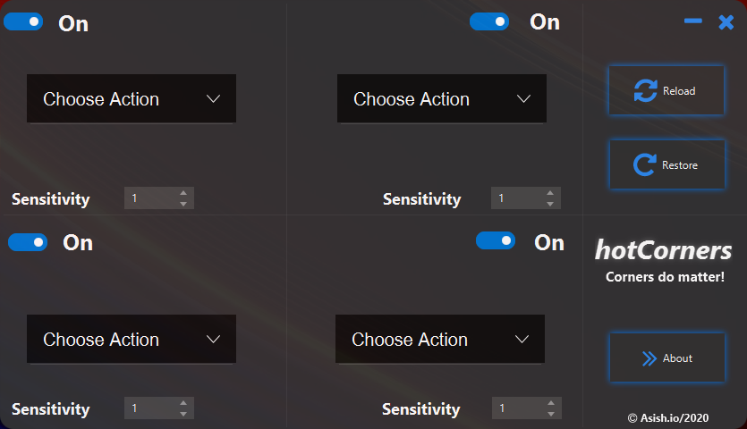
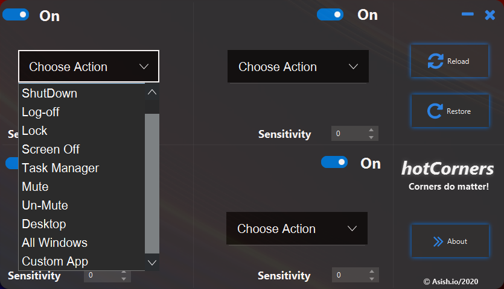
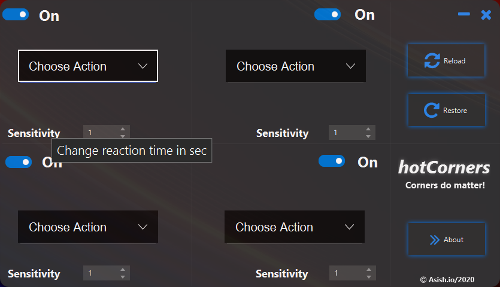
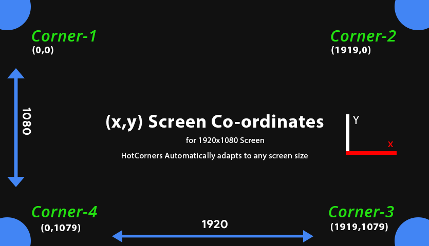
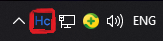
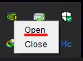

# HotCorners

<p align="center">
  <a href="https://sourceforge.net/projects/hotcorners/files/latest/download"></a>
</p>

[](https://sourceforge.net/projects/hotcorners/files/latest/download)

## What It Does❓
- HotCorners is a utility software that allow users to set events to the 4 corners of the screen
- This events are automatically triggered when mouse/cursors move into those corners
- With the help of GUI user can choose from the list of events available or can set own script files to trigger when the cursor move into those corners
- User can also set sensitivity(reaction time) for the event to trigger

## Screenshots 📸
 
 


## Built On 🛠
### Java
  
  - Why JAVA u may ask for such an OS centric task, simple cause my projects cant wait for me to learn **C#** and implement this, now u may ask why not **C++** well making GUI with **C++** is like  🤯

### JavaFx
- **[OpenJFX]** is an open source, next generation client application platform for desktop, mobile and embedded systems built on Java,And the only way to bring mordern UI design into **Java**
### jMetro
- **[jMetro]** is not a theme that tries to mimic the native Windows theme / look and feel, or a theme that is a direct copy of Fluent Design. It is rather a theme inspired by Fluent Design and adapted to fit the JavaFX SDK, Windows is where **HotCorners** feels home so why not get native feel.

#### Some other libraries used for internal working are available in ```dist/lib```


## How It Works🤔

 

- Well the above figure tells you all how it works!
- There are 2 threads that make HotCorners work
- One thread, gets the mouse cursor co-ordinates at an interval of 1sec and checks it to any of the four corners co-ordinates
- If any of the corner co-ordinates match, then the event set by the user is triggred.
- Simple right! easy peasy.
- Ohh, what about the other thread? 
- Yup you guessed it right, its for running GUI/Getting User changes.

## Using UI  👀
### HotCorners always start at system tray from where the user can open GUI for making changes



- **HotCorners** runs at startup automatically, we this action is not desired this can be simply be turned off by opening the ```startup``` folder in windows 10 and deleting ```HotCorners.exe```.
- The UI is pretty simple to understand and clean.
- Each corner has a sensitivity counter that goes from ```1-10``` sec, which in turn will change the reaction time for the event to trigger for that paticular corner.
- It is **Recommended** to turn off the corner if not in use.
- In order for the effects to take place **Reload** button needs to be clicked and give it like ```2 sec``` to load new event triggers.
- The **Restore Button** restores the default settings for HotCorners, when clicked the app closes which needs to be restarted manually.
## Know Problems❌
- Dosen't work with multiple monitor setup.
- Tested only on the latest Build of ```Windows 10 Build 18362```.
- Some events do not work on older builds of ```Windows 10 ```.
## Work In Progress🚧 
- Working on **Code optimization**.
- Adding more events ```4 events added in update V1.2.0```
- UI Changes/Fix

## Channel Log
### Update V1.2.0
- Added more 4 more events.
- Fixed sensitivity bug.
- Fixed screen off bug.
- improved code quality.

## How To Contribute🤝 
- Yes,it is open source you can clone and change code to your need.
- Most of the code is self explanatory, anyhow
- for any clarification on code or want to contribute contact vashish888@gmail.com / [twitter]

[twitter]: <https://twitter.com/vashish888>
[OpenJFX]: <https://openjfx.io/>
[jMetro]:<https://pixelduke.com/java-javafx-theme-jmetro/>
